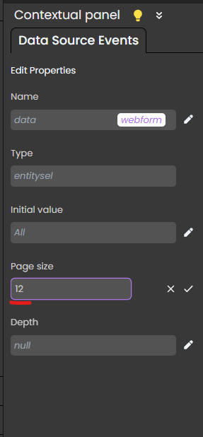

# Overview

DataGrid's Qodly component using [react-table](https://github.com/TanStack/table)


## Featurees

|                                        | DataGrid | DataTable |
| -------------------------------------- | -------- | --------- |
| Customizable columns                   | ✔️       |           |
| Sorting                                | ✔️       | ✔️        |
| Filtering                              |          |           |
| ReOrder                                | ✔️       | ✔️        |
| Infinite scrolling (Virtual scrolling) | ✔️       | ✔️        |
| Pagination                             | ✔️       |           |
| Sticky Header                          | ✔️       | ✔️        |
| Save state in Qodly Source             | ✔️       |           |
| Save state in localStorage             | ✔️       |           |
| Resizing                               | ✔️       | ✔️        |
| AutoFit                                |          |           |
| Styling and themes (using CSS)         | ✔️       | ✔️        |
| Editable cells                         |          |           |
| Stacked Header                         |          |           |
| AutoWrap columns cells                 |          |           |
| Column Chooser                         | ✔️       |           |
| Hide & show                            | ✔️       |           |
| Grouping By                            |          |           |
| Export                                 |          |           |

## TODO:

- Search in column : need POC
- AutoFIt : need POC
- Styling (CSS) : On going
- Editable cells : need POC
- Remove Unnecessary properties
- Tested with Array of object

## Save State

You can save the state of column visibility, Size and order using `Qodly Source` or `localStorage`:

- **Column Visibility**: Toggle column visibility, and changes will be automatically saved.
- **Column Size**: Change the Size of the column and make it suitable for your screen, the new sizes will be saved.
- **Column Order**: Reorder columns by dragging and dropping them, and the new order will be saved.

`localStorage` will only work when the DataGrid is not linked to any `Qodly Source`.

## Triggers and Events

The DataGrid component can respond to various events, enabling dynamic user experiences.

- **On Select**: Calls for an action when an item within the component is selected.
- **On Click**: Calls for an action when the user clicks on the component.
- **On DoubleClick**: Calls for an action when the user double-clicks on the component.
- **On HeaderClick**: Calls for an action when the user clicks on the header of a column.
- **On HeaderDoubleClick**: Calls for an action when the user double-clicks on the header of a column.
- **On CellClick**: Calls for an action when the user clicks on a cell within the component.
- **On CellDoubleClick**: Calls for an action when the user double-clicks on a cell within the component.
- **On MouseEnter**: Calls for an action when the user's mouse cursor enters the area of the component.
- **On MouseLeave**: Calls for an action when the user's mouse cursor exits the area of the component.
- **On MouseOver**: Calls for an action when the user's mouse cursor is over the area of the component.
- **On SaveState**: Calls for an action when the user change the component's state.

## Pagination mode:

By default, the datasource's page size is set to 100. To set the initial value of your datagrid's page size, you need to go the edition section of your datasource, and set it from there.



## Styling

you can easily restyle your table using by creating a CSS class and bind it to your table

```CSS

self table {
  border-collapse: collapse;
  width: 100%;
}

self th,
td {
  text-align: left;
  padding: 8px;
}

self th {
  background-color: #005689;
  color: white;
}

self tr:hover {
  background-color: #d5eeff;
}

self tr.selected,
self tr:nth-child(even).selected {
  background-color: #007cb9;
}

self tr:nth-child(even) {
  background-color: #f2f2f2;
}

self .visibility-menu-button {
	background-color: #005689;
  color: white;
}

self .visibility-menu-button-checked,
self .visibility-button{
	border-color: #005689;
	color: #005689;
}

```
