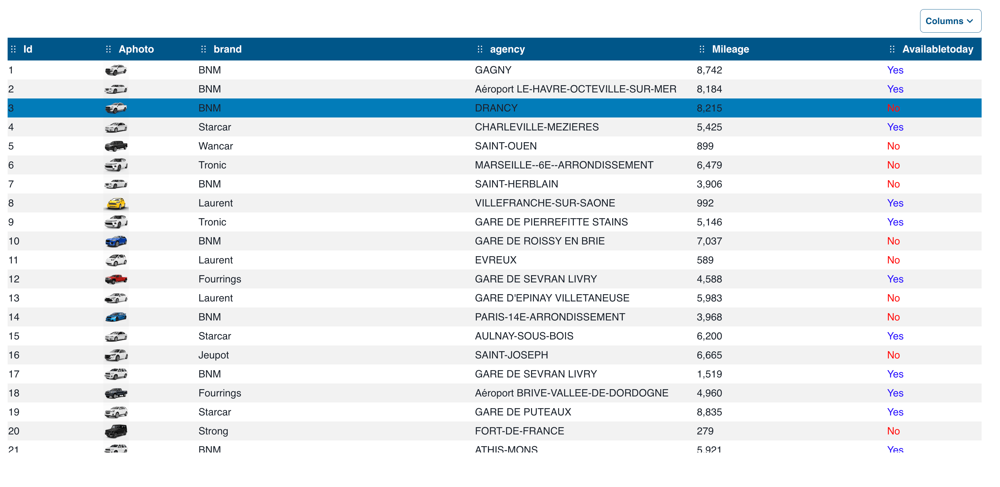

# Overview

DataGrid's Qodly component using [react-table](https://github.com/TanStack/table)



## Featurees

|                                        | DataGrid | DataTable |
| -------------------------------------- | -------- | --------- |
| Customizable columns                   | ✔️       |           |
| Sorting                                | ✔️       | ✔️        |
| Filtering                              | ✔️       |           |
| ReOrder                                | ✔️       | ✔️        |
| Infinite scrolling (Virtual scrolling) | ✔️       | ✔️        |
| Pagination                             | ✔️       | ✔️        |
| Sticky Header                          | ✔️       | ✔️        |
| Save state in localStorage             | ✔️       |           |
| Resizing                               | ✔️       | ✔️        |
| AutoFit                                |          |           |
| Styling and themes (using CSS)         | ✔️       | ✔️        |
| Editable cells                         |          |           |
| Stacked Header                         |          |           |
| AutoWrap columns cells                 |          |           |
| Column Chooser                         | ✔️       |           |
| Hide & show                            | ✔️       |           |
| Grouping By                            |          |           |
| Export                                 |          |           |

## TODO:

- Search in column : On going
- AutoFIt : need POC
- Styling (CSS) : On going
- Editable cells : need POC
- Save State in a dataSource : On going
- Remove Unnecessary properties
- Tested with Array of object

## Save State

You can save the state of column visibility and order using `localStorage`:

- **Column Visibility**: Toggle column visibility, and changes will be automatically saved.
- **Column Order**: Reorder columns by dragging and dropping them, and the new order will be saved.

## Styling

you can easily restyle your table using by creating a CSS class and bind it to your table

```CSS

self table {
  border-collapse: collapse;
  width: 100%;
}

self th,
td {
  text-align: left;
  padding: 8px;
}

self th {
  background-color: #005689;
  color: white;
}

self tr:hover {
  background-color: #d5eeff;
}

self tr.selected,
self tr:nth-child(even).selected {
  background-color: #007cb9;
}

self tr:nth-child(even) {
  background-color: #f2f2f2;
}

self .visibility-menu-button {
	background-color: #005689;
  color: white;
}

self .visibility-menu-button-checked,
self .visibility-button{
	border-color: #005689;
	color: #005689;
}

```
